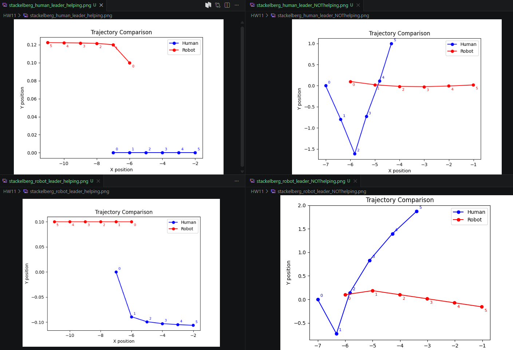

You are given the code for a simplified autonomous car and human driver.
We want to develop an algorithm that plans the robot's actions using game theory.
Specifically, we will implement Stackelberg Games to reach tractable solutions.
Complete the following steps:

1. Explain the vehicle dynamics. What are actions, and how do these actions cause the vehicles to move?

    The action is essentially an angle in radians pointing in the direction to move forward one step.
    The angle gets converted into an x, y displacement that is added to their current location, causing them to move in the action's direction.

2. Explain the current cost functions. What is the human optimizing for? What is the robot optimizing for?
    The human runs on a minimization function whose cost increases when he gets close to the robot, and decreases when he moves in the positive x direction. So, the human is incentivized to move away from the robot and forward in the x direction.

    The robot's cost decreases based on the human moving forward, so in minimizing its cost, the robot is incentivized to move the human forward in the x direction.

3. Run the code and find the optimal human trajectory. How does this trajectory change if the robot changes its initial state or motion?

    If we move the robot below the human, the human moves up.
    If we move the robot ahead of the human, the human goes straight forward.
    If we move the robot behind the human, the human also goes straight.
    
4. Implement a Stackelberg Game where the robot plays first. Compare your solutions when the robot is trying to help the human (current reward) and when the robot is trying to delay the human (altered reward).
5. Reverse the Stackelberg Game so that the human plays first. How are these solutions different from the solutions for the previous question?

    They result in quite the difference in results. I noticed that the leader tends to move more than the follower in both cases.

    Plot 1 shows how the human just went forward while the robot went the other way so as to get out of the human's way, reducing the cost for the human since he wants to avoid being near the robot. But, in the adverse case (Plot 3), we can see the robot goes forwards and wants to decrease the human's ability to move forward. I did have to increase the weights a bit for this to visualize. Now switching roles, starting with the robot helping (Plot 2), the robot goes straight back, moving as far from the human as it can, and the human goes forward after he deems an acceptable spacing from the robot (due to the aforementioned increased weights). The human seems to do better in the adverse case with the robot leader (Plot 4), and I believe this is due to the robot deciding to veer off away from the human. I believe it could be solved with different weighting, and by telling the robot to stay closer to the human and ahead of it to be able to block its path better.

(1) HW11/stackelberg_human_leader_helping.png
(2) HW11/stackelberg_robot_leader_helping.png
(3) HW11/stackelberg_human_leader_NOThelping.png
(4) HW11/stackelberg_robot_leader_NOThelping.png
