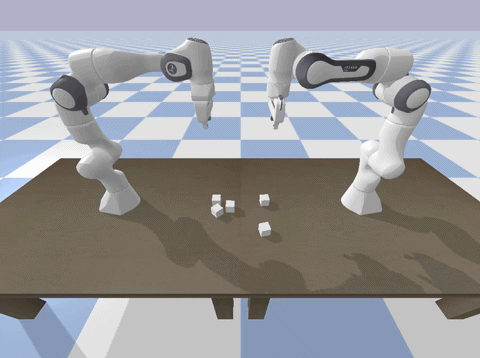

# HW4

Dylan Losey, Virginia Tech.

In this homework assignment we will coordinate two robot arms to avoid collisions.

## Install and Run

```bash

# Download
git clone https://github.com/vt-hri/HW4.git
cd HW4

# Create and source virtual environment
# If you are using Mac or Conda, modify these two lines as shown in [HW0](https://github.com/vt-hri/HW0)
python3 -m venv venv
source venv/bin/activate

# Install dependencies
# If you are using Mac or Conda, modify this line as shown in [HW0](https://github.com/vt-hri/HW0)
pip install numpy pybullet

# Run the script
python main.py
```

## Expected Output

Two robot arms try to grasp random cubes (they may collide and fail).


## Assignment

Modify the provided code in `main.py` to complete the following steps:
1. You can control both robots. Develop a strategy for the robots to efficiently pick up the blocks without collisions. Describe your strategy in words or pseudocode, and then implement it.
2. You can only control one robot. The other robot chooses blocks uniformly at random. Develop a strategy to maximize the overall success of the team, and then implement it. You may need to try multiple strategies, and then compare them.
3. You can only control one robot. The other robot chooses the block closest to its base 50% of the time, and the other 50% of the time it grasps a random block. Develop and implement a strategy to coordinate with that robot.
