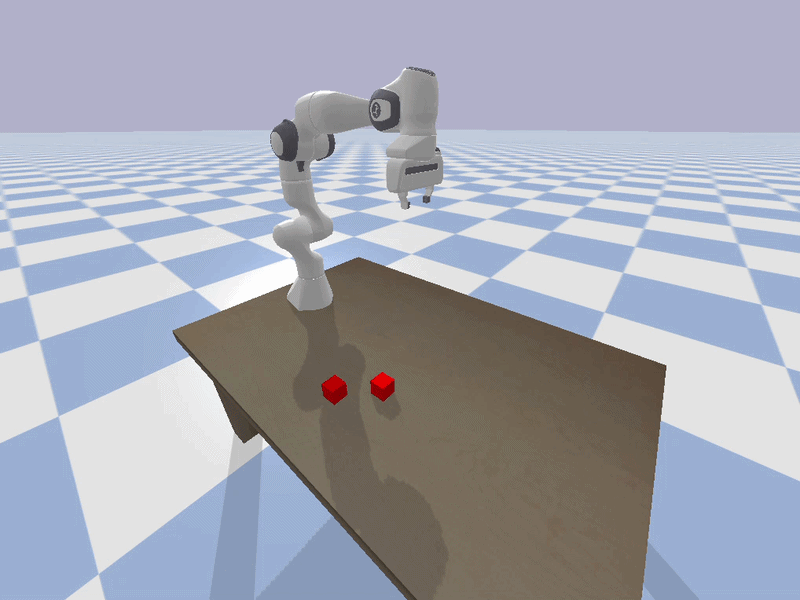

# HW6

Dylan Losey, Virginia Tech.

In this homework assignment we will program legible robot motion.

## Install and Run

```bash

# Download
git clone https://github.com/vt-hri/HW6.git
cd HW6

# Create and source virtual environment
# If you are using Mac or Conda, modify these two lines as shown in [HW0](https://github.com/vt-hri/HW0)
python3 -m venv venv
source venv/bin/activate

# Install dependencies
# If you are using Mac or Conda, modify this line as shown in [HW0](https://github.com/vt-hri/HW0)
pip install numpy pybullet

# Run the script
python main.py
```

## Expected Output



## Assignment

Your goal is to modify the robot's motion so that it clearly conveys its goal to human onlookers. 
There are initially two cubes on the table: the robot is programmed to move to cube 1, but the user does not know which cube that is.
Modify your code as needed to complete the following steps:
1. Try initializing the cubes closer together or farther apart. How does this affect the human's understanding of the robot's goal?
2. Exaggerate the robot's motion so that it quickly conveys its goal. Is it better for the robot to exaggerate its motion at the start or end of the trajectory?
3. Find a trade-off between legible motion and task completion.
4. Scale up your code so that it works for three cubes.